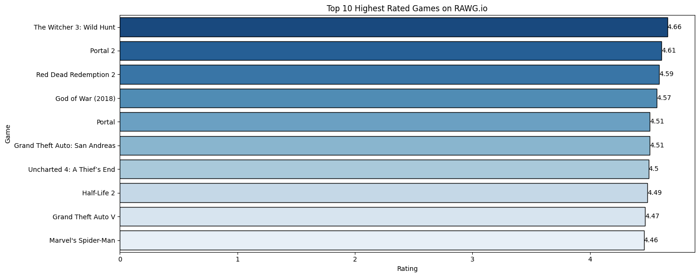

# RAWG.io Game Data Analysis

  

1. [Overview](#overview)
2. [Methodology](#methodology)
3. [Exploratory Data Analysis](#exploratory-data-analysis)
4. [Results and Conclusion](#results-and-conclusion)
5. [Recommendations](#recommendations)
6. [Dashboard](#dashboard)

## Overview
This analysis delves into the vast realm of gaming data, specifically focusing on insights derived from RAWG.io, a comprehensive video game database. The project aims to unravel crucial aspects of gaming trends, user preferences, and industry behavior by examining an array of gaming-related metrics such as game titles, genres, user engagement, platform popularity, and more. By conducting a comprehensive analysis of this diverse data the goal is to extract valuable insights to aid in understanding the gaming landscape especially for those that want to get into gaming.

**Key Objectives**:
- User Engagement and Game Performance Analysis: Evaluating user interactions, playtime metrics, and user-generated content to assess the performance and engagement levels of different game titles.
- Genre, Tag, Platform, Store, Developer, Publisher Preferences: Analyzing consumer preferences and adoption rates across gaming genres and platforms to identify emerging trends and target demographics.
- Genre Rating: Delving into player preferences based on average ratings per genre, identifying which gaming genres resonate most with users and correlating these preferences with engagement metrics.
- Best Performing Developers:  Evaluating and ranking developers based on the production of highly rated games, exploring patterns in developer performance, and identifying studios renowned for consistently delivering high-quality gaming experiences.

## Methodology

### Data Source
The data used for this analysis is from [RAWG.io](https://rawg.io/)s API (Application Programming Interface) that provides comprehensive access to a vast array of gaming-related data. The API allows retrieval of detailed information about games, including but not limited to title, genre, platform, release date, user reviews, ratings, and developer details. RAWG.io's extensive database encompasses a wide spectrum of gaming platforms, spanning consoles, PC, mobile, and more.

The API could be accessed from the top right of the home page of the platform.

  

After registering access for the API key will now be provided.

  

With the API key provided requests now could be made to call the API for data. There is a limit for request made which is 20,000 free request for the free tier. There is a paid tier to have higher request limits but I opted to use the free tier since I only intend to use this for data gathering and not on enterprise purposes. 

### Data Acquisition, Cleaning and Preprocessing
After making calls to the API I was able to obtain 159560 records of game data. The extraction of data was done on December 20, 2023. I used the official API [documentation](https://api.rawg.io/docs/) as references for performing API calls, assigning and checking data types when performing data normalization

To further highlight the process of data processing here are the full steps I've taken to achieve the final data I used for the analysis.

#### General Game Data
This is the first data I've fetch from calling this URL *https://api.rawg.io/api/games* thus returning this data.

  

#### Joining the Developer and Publisher Data to the General Game Data
This are additional data I've pulled from calling this two URLs *https://api.rawg.io/api/developers* and *https://api.rawg.io/api/publishers*. To join this data to the general games data frame, I had to map each specific game i.d that a developer and publisher have from the the games column (contains values with specific i.d for games that have been developed and published respectively) and assign the name of that developer and publisher to that specific game i.d in the general game data frame.

  

#### Final Data Frame
After dropping and renaming some columns the final dataframe looks like this.

  

#### Data Normalization and Database Schema
Normalizing the data is the next step of the process. I wanted to create a local database instance to store the data thus the reason for normalizing it. I grouped certain categories that are somewhat related and I created join tables or junctions for certain data. This now serves as the database schema that will be the basis for subsetting the data when data cleaning and preprocessing is performed.

  

#### Data Prep
To prepare the data for the local database upload it still needs a lot of cleaning and preprocessing because some of the values stored in the columns are in a dictionary format therefore it needs to be unstructured in a way for it to be values for each unique game. To see the whole process of preparation access this [notebook](https://github.com/Kimchi21/RAWG.io_Game-Data-Analysis/blob/main/Python%20Notebooks/Normalize_Data-%26-Upload_to_DB.ipynb).

## Exploratory Data Analysis
The final dataset still consisted of 159560 records unique game data which is divided into 15 tables via normalization and a local MySQL database instance was developed to store these data.

### Key Insights from EDA

### User Engagement and Game Performance

#### 1. **Top 10 Oldest and Newest Games Released**

**Top 10 Oldest Games**
| game_name                | released   |
|--------------------------|------------|
| Bertie the Brain         | 1954-08-25 |
| Tennis for Two           | 1958-10-18 |
| Spacewar!                | 1962-01-01 |
| ZeusOfTheCrows           | 1970-01-01 |
| Star Trek (1971)         | 1971-01-01 |
| Baseball (1971)          | 1971-01-01 |
| The Oregon Trail (1971)  | 1971-01-01 |
| Empire                   | 1971-01-01 |
| Galaxy Game              | 1971-01-11 |
| Computer Space           | 1971-01-11 |

These games represent some of the earliest creations in the history of gaming. They date back to the mid-20th century and early 1970s, signifying the foundational period of video game development and the emergence of gaming as a form of entertainment.

**Top 10 Newest Games**
| game_name                               | released   |
|-----------------------------------------|------------|
| Mocap Fusion [ VR ]                     | 2023-12-17 |
| Gay Sex Adventures - Episode 2           | 2023-12-17 |
| 100 Asian Cats                          | 2023-12-17 |
| Nudel Tag                               | 2023-12-17 |
| Heart-S-Truck                           | 2023-12-17 |
| Boxing Simulator                        | 2023-12-17 |
| Sanguo's Ambition 4 :Three Kingdoms     | 2023-12-17 |
| Christmas Puzzle 4                      | 2023-12-17 |
| Null Gravity Labyrinth                  | 2023-12-17 |
| LoveArena                               | 2023-12-17 |

These games represent the latest additions in the gaming industry, all released on the same date. They showcase contemporary game titles that reflect the current trends, technological advancements, and creative innovations prevalent in modern game development.

#### 2. **Top 10 Games with the Highest Average Playtime**

  

Shaiya comes in at the top with a staggering 1473 hours of average playtime. This is followed by Spreadstorm and Amberial Dreams, with an average playtime of 1046 and 1020, respectively. I think a possible reason for Shaiya's high average playtime is because it is a massively multiplayer online (MMO) game in which this type of game typically involves heavy grinding.

#### 3. **Top 10 Highest and Lowest Rated Games According to Metacritic Rating**

  

The highest-rated game based on metacritic score is The Legend of Zelda: Ocarina of Time, with a metacritic score of 99. On the other hand, the lowest-rated game based on metacritic score is Orc Slayer, with a metacritic score of 15. One thing I noticed is that the most highly rated games are from Nintendo.

#### 4. **Distribution of ESRB Ratings**

  

For the distribution of ESRB ratings for games on RAWG.io, a lot of them are not rated, which comes in 136596 games: 3498 games are for everyone; 8909 games are for everyone above 10 years old; 6567 are for teens and above; 2735 are for mature audiences; 1170 are for adults only; and finally, there are 76 games whose ESRB ratings are still pending.

#### 5. **Top 10 Games with the Highest Rating on the Platform**

  

The top-rated games on RAWG.io are The Witcher 3: Wild Hunt with a rating of 4.66, followed by Portal 2 with a rating of 4.61, and Red Dead Redemption 2 with a rating of 4.59. 

  

The games present here could also be seen in RAWG.io's All-Time Top 250 section.

#### 6. **Top 10 Games with the Highest Review Counts**

  

The top games with the most number of reviews are Grand Theft Auto V with 6750 reviews, followed by The Witcher 3: Wild Hunt with 6481 reviews, and then Portal 2 with 5585 reviews. Interestingly the most highly rated game in the platform came in at second being beaten by GTA V.

#### 7. **Top 10 Games with Highest Ratings Score (Exceptional, Recommended, Meh, Skip) Obtained**

RAWG.io uses a 4 point system for rating games. 

  

  

Games with Highest Ratings Score (exceptional, recommended, meh, skip) Obtained:

- Exceptional Ratings: The top game with the most exceptional rating is The Witcher 3: Wild Hunt, with 5002 counts, followed by Grand Theft Auto V with 3991, and then Portal 2 with 3926 counts. The gap between the counts of the top 1 and top 2 is big compared to the top 2 and top 3 games.

- Recommended Ratings: The top game with the most recommended rating is Tomb Raider (2013), with 2333 counts, followed by Grand Theft Auto V with 2206, and then Left 4 Dead 2 with 1712 counts.

- Meh Ratings: The top game with the most meh rating is Conter-Strike: Global Offensive, with 894 counts, followed by Dota 2 with 875, and then Fallout 4 with 836 counts.

- Skip Ratings: The top game with the most kip rating is Dota 2, with 689 counts, followed by Conter-Strike: Global Offensive with 383, and then The Playroo with 360 counts.

My main observation from this is that games which are more on the single player experience are highly rated compared to games which involve some form of Player vs. Player setup like CS 2 and Dota 2.

#### 8. **Top 10 Games which were Added the Most to Players Libray**

  

The games that were added the most to players personal libraries are Grand Theft Auto V with 20382 counts, followed by The Witcher 3: Wild Hunt with 19700, and then Portal 2 with 18602 counts. This game could be seen achieving high ratings or high rating scores, particularly being given exceptional ratings.

#### 9. **Top 10 Games with the Most Number for each Library Status**

  

Games with Highest Number for each Library Status Obtained:

- Dropped: The most dropped games are Counter-Strike: Global Offensive with 1961 records, followed by Team Fortress 2 with 1761 records, and then Dota 2 with 1646 records. There is one thing in common here and that is all three of this games do involve Player vs. Player set-up.

- Yet/Yet to be Owned: The games with the highest count of yet library status is The Witcher 3: Wild Hunt with 1098 records, followed by Red Dead Redemption 2 wwith 906 records, and then Deus Ex: Mankind Divided with 874 records. This games can be seen being highly rated by other players.

- Owned: The most owned game recorded across players libray is Counter-Strike: Global Offensive with 12342 records, followed by Grand Theft Auto V with 11714 records, and then Left 4 Dead 2 with 11532 records.

- Beaten: The games with the most beaten libray status is Grand Theft Auto V with 5756 records, followed by Portal 2 with 5390 records, and then Portal with 4887. This games are based on adventure with a set story thus it can be completed.

- ToPlay/To be Played: The games with the most records of to be played are Cyberpunk 2077 with 2415 records, followed by Red Dead Redemption 2 with 1593 records, and then Death Stranding with 1357 records.

- Playing: The games with the most amount of currently playing are Red Dead Redemption 2 with 900 records, followed by The Witcher 3: Wild Hunt with 865 records, and then Grand Theft Auto V with 718 records. This games are open-world and typically have a lot of content to do thus having high replayability.

### Genre, Tag, Platform, Store, Developer, Publisher Preferences

#### 10. **Distribution of General and Specific Platforms**

  

PC is the most dominant form of platform for games, with a high count of 110279. Web follows up with a count of 24356, and then Apple Macintosh with 21756 counts. PC games outnumber both mobile and console platforms.

  

Again just like in the general platform PC is still the most popular platform compared to all specific mobile and console platforms.

#### 11. **Distribution of Specific Stores**

  

The most popular store is itch.io, with a count of 61234; it is followed by Steam, with 55249 counts.

#### 12. **Distribution of Genres**

  

The most popular genre for games is action, with a count of 44193, followed by adventure with 37851 counts, and then indie with 37263 counts. On the other hand, card, family, and educational are the least popular genres for games, with 942, 1112, and 1311 counts, respectively.

#### 13. **Distribution of Tags**

  

The most prevalent tags in games are singleplayer with 72476 counts, followed by 2D with 27499 counts, and then Steam Achievements with 24727 counts.

#### 14. **Distribution of Developers**

  

The developer(s) who have made the most number of games are Reactor, with a total of 11 games developed. This is followed by Fancy Bytes, Falco Softwawre, and Lda, with 9 total games made each. Then finally, PolarityFlow with 8 games developed.

#### 15. **Distribution of Publishers**

  

The publisher(s) who publish the most number of games are Creative Black Chair, with a total of 38 games published. Followed by Voltage and Hunny Bunny Studio, with 36 total published games each. Then Light of Creators, with 35 games published.

### Genre Rating

#### 16. **Average Rating for Each Genre**

  

The game genre with the highest average rating is Platformer, with a rating of 3.66; this is followed by Fighting, with a rating of 3.64; and then Family, with a rating of 3.55. On the other hand, massively multiplayer, casual, and indie genres have obtained the lowest ratings for genres with 2.87, 3.04, and 3.06, respectively.

### Best Performing Developers

My approach to determining which developers have made the most highly rated games uses a combination of weighted average and a threshold for determing the optimal number of games they produced. 

The reason I used weighted average is to take into account the number of games a developer has released. Developers with more games will have a more substantial impact on the average, while those with fewer games will contribute less to the overall average.

On the other hand, my reasoning for including a threshold is because if I use no threshold then automatically any developer with one game which is highly rated will have it as its average rating even though there is no average calculation performed. Developers with fewer games might be excluded from the analysis or be shown separately to avoid misleading averages. Thus by setting a threshold a more somewhat fair evaluation of which developers has made highly rated games

  

- Threshold 1 to 6: These thresholds include all top 10 developers and maintain relatively stable ratings. These thresholds ensure consistency in the top developers' rankings.

- Threshold 7: At this threshold, the number of included developers decreases to 5, potentially sacrificing inclusivity for increased stability. The stability also increases slightly, indicating more consistent ratings among the remaining developers.

- Threshold 8, 9, 10: These thresholds include only 1 developer each. These thresholds severely limit the number of developers considered and might not provide reliable ratings due to small sample sizes.

  

Naughty Dog stands out as the top developer, producing games with the highest average rating of 4.50. Following closely, Yacht Club Games secures the second position with an average game rating of 4.44, while Nintendo claims the third spot with their games achieving an average rating of 4.41. All of the developers here are highly regarded as they have produce the most popular games ever known. Here are some of the notable games they have developed:

- Naughty Dog - Uncharted series, The Last of Us series.
- Yacht Club Games - Shovel Knight series.
- Nintendo - Mario, Zelda, Super Smash Bros, Pokemon, Donkey Kong, Animal Crossing.
- Rockstar Games/Rockstar North - Grand Theft Auto (GTA) series, Read Dead Redemption series, Max Payne series, Manhunt series.
- FromSoftware - Souls franchise (Demon Souls and Dark Souls), Elden Ring, Sekiro.
- Retro Studios - Metroid, Mario Kart
- Monolith Soft - Xenoblade Chronicles series
- Bethesda Softworks - Fallout series, dishonored series, elder scrolls series, doom series,
- Capcom - Resident Evil series, Devil May Cry series, Street Figther series.

In some point in my life I have probably played one(or more) of the games listed for each developer and I can agree of the ratings they have receive.

## Results and Conclusion

**User Engagement and Game Performance**
- The analysis highlighted a wide spectrum of gaming experiences, from some of the earliest games dating back to the mid-20th century to the latest contemporary titles released on the same date. This showcases the evolution of gaming from its foundational period to the current era of innovative and technologically advanced creations.

**Game Metrics Analysis**
- The highest average playtime was recorded for games like Shaiya, Spreadstorm, and Amberial Dreams, suggesting an engaging gameplay experience, particularly for massively multiplayer online (MMO) games, which often involve extensive grinding elements.

**Ratings and Reception**
- Games such as The Legend of Zelda: Ocarina of Time received exceptionally high Metacritic scores, whereas Orc Slayer received notably low ratings. It's noteworthy that Nintendo games tended to rank among the highest-rated titles.

**ESRB Ratings Distribution**
- The distribution of ESRB ratings showed a significant portion of games not being rated, indicating varied content available. Games targeted at different age groups showed a diverse presence on the platform.

**Top-Rated Games and User Engagement**
- The top-rated games on RAWG.io, like The Witcher 3: Wild Hunt and Portal 2, garnered high user engagement and review counts, contributing to their exceptional ratings.

**Library Status and Player Behavior**
- Player behaviors reflected in library status (Owned, Playing, Dropped, etc.) showcased varied preferences for game completion and ongoing engagement. Single-player games were more likely to be owned or completed compared to PvP-centric games.

**Genre, Platform, and Store Preferences**
- PC gaming dominated the platform preference, while action, adventure, and indie genres were the most prevalent among gamers. Notably, specific stores like itch.io and Steam hosted a significant number of games.

**Developer and Publisher Insights**
- Several developers and publishers stood out in terms of the number of games developed or published. The notable performances of developers like Naughty Dog, Yacht Club Games, and Nintendo were reflected in their high average game ratings.

**Conclusion**

This extensive analysis of gaming data sheds light on crucial facets of user engagement, game performance, player preferences across genres, platforms, and developers. These insights are invaluable, enabling informed decisions regarding game development, marketing strategies, and platform optimizations to enhance player experiences and market competitiveness in the gaming industry.

## Recommendations
For someone new to gaming:

**Explore Diverse Genres:**
- Try various game genres like action, adventure, puzzle, or simulation to find what interests you the most.

**Start with Popular Titles:**
- Begin with well-reviewed games across different platforms to experience a variety of gaming styles and stories.

**Consider Gaming Platforms:**
- Choose a platform (PC, console, mobile) based on your preferences for gaming convenience and types of games available.

**Community Engagement:**
- Join gaming communities or forums to seek recommendations, tips, and connect with other players for a more engaging experience.

**Enjoy the Experience:**
- **Have fun!** Gaming is about entertainment and relaxation. Don’t be afraid to explore and enjoy the games at your own pace.

## Dashboard
To be added...